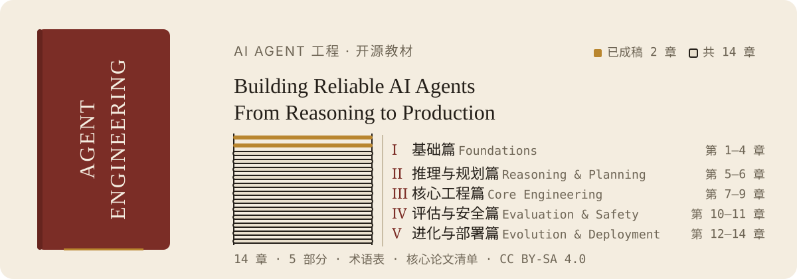

  

# Agent Engineering

**Building Reliable AI Agents: From Reasoning to Production**

> 一本系统性讲解 AI Agent 工程的开源教材。已规划五部分共 14 章，覆盖从推理、规划到生产部署的 Agent 开发知识体系；其中第 1-2 章已成稿，第 3-14 章为大纲，将陆续补齐。

## 目录

> 图例：✅ 已成稿 · 🚧 大纲（待展开）

### 第一部分：基础篇

| 章节 | 主题 | 状态 |
|------|------|------|
| [第 1 章](chapters/ch01-what-is-agent.md) | Agent 是什么 | ✅ |
| [第 2 章](chapters/ch02-harness.md) | Harness——Agent 的缰绳 | ✅ |
| [第 3 章](chapters/ch03-core-patterns.md) | Agent 核心模式 | 🚧 |
| [第 4 章](chapters/ch04-frameworks.md) | 主流 Agent 框架 | 🚧 |

### 第二部分：推理与规划篇

| 章节 | 主题 | 状态 |
|------|------|------|
| [第 5 章](chapters/ch05-reasoning.md) | 推理能力 | 🚧 |
| [第 6 章](chapters/ch06-planning.md) | 规划与决策 | 🚧 |

### 第三部分：核心工程篇

| 章节 | 主题 | 状态 |
|------|------|------|
| [第 7 章](chapters/ch07-context-engineering.md) | Context Engineering | 🚧 |
| [第 8 章](chapters/ch08-memory.md) | 记忆系统 | 🚧 |
| [第 9 章](chapters/ch09-tools.md) | 工具使用与环境交互 | 🚧 |

### 第四部分：评估与安全篇

| 章节 | 主题 | 状态 |
|------|------|------|
| [第 10 章](chapters/ch10-evaluation.md) | Agent 评估 | 🚧 |
| [第 11 章](chapters/ch11-safety.md) | 安全与对齐 | 🚧 |

### 第五部分：进化与部署篇

| 章节 | 主题 | 状态 |
|------|------|------|
| [第 12 章](chapters/ch12-self-evolving.md) | Agent 自进化 | 🚧 |
| [第 13 章](chapters/ch13-production.md) | 生产部署 | 🚧 |
| [第 14 章](chapters/ch14-frontiers.md) | Agent 应用前沿 | 🚧 |

### 附录

- [术语表](references/glossary.md)
- [核心论文清单](references/papers.md)
- [配套示例](chapters/ch01-what-is-agent.md)（目前仅第 1 章内嵌代码示例）

## 适合谁

- 想构建可靠 Agent 系统的工程师
- 想理解 Agent 技术原理的产品经理
- 想系统学习 Agent 工程的技术管理者

## 前置知识

- 基本的 Python/TypeScript 编程能力
- 对 LLM 有基础了解（知道什么是 prompt、API 调用）

## 如何使用

1. 按章节顺序阅读，每章相对独立
2. 第 1-2 章末尾有思考题，建议动手实践（其余章节待补）
3. 代码示例目前仅见第 1 章正文（其余章节待补）
4. 参考论文在 `references/papers.md`

  

## 许可证

本书内容采用 [Creative Commons Attribution-ShareAlike 4.0 International (CC BY-SA 4.0)](LICENSE) 许可证发布。
